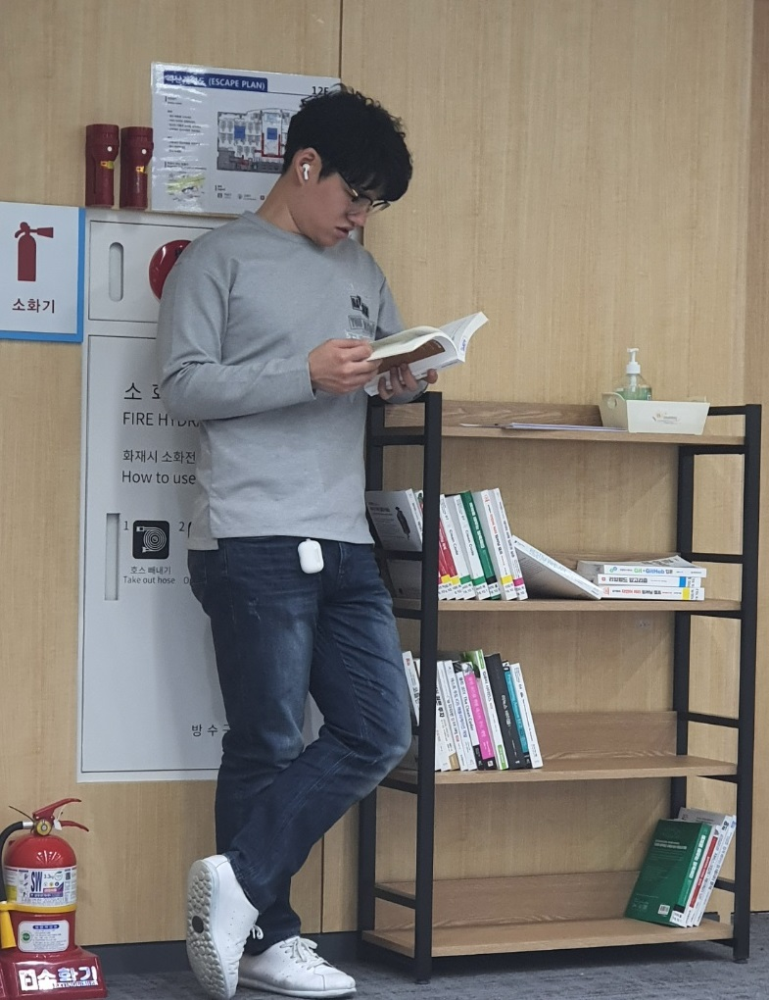

# resume 

 

## [한국어] [[English]](./README_eng.md)
 

## 자기소개 
- 이름: 오석빈
 - 정보보안담당자, 백엔드/서버엔지니어 

모든 물이 바다에 모이는 이유는 바다가 가장 낮기 때문이다. 바다같은 사람이 되자. 겸손하고 낮은자세를 유지하자.

죽기 전에 내가 꼭 가보고 싶은 곳들, 경험해보고 싶은 일들, 그것들을 꾸준히 해보자. 
하나씩 하나씩. 이것저것 너무 고민하지 말고. 
 
- 취미 : 달리기, 리듬게임, 글쓰기, 여행, 독서
- 관심있게 읽은 책 : 객체지향의 사실과 오해, 후니의 쉽게 쓴 시스코 네트워킹:시스코 전문가가 말하는 네트워크 따라잡기

- Email: osb330@naver.com 
- GitHub: [github.com/hasihime](https://github.com/hasihime)
- LinkedIn: [https://www.linkedin.com/in/seokbin-oh-1028a019a/](https://www.linkedin.com/in/seokbin-oh-1028a019a/)
- Techlog : [https://hasihime.github.io/hasi-techlog/](https://hasihime.github.io/hasi-techlog/)

## 학력
- 가천대학교 컴퓨터공학과(2013 ~ 2019)

## 단체경력
- 삼성 청년 SW 아카데미 2기(2019 ~)

## 인턴경력

- 네오위즈 :보안팀(2018.06 ~ 2018.12)
  - IDS(suricata), IPS(Tipping Point) 운용 
  - IPS FOC 진행
  - ISMS 심사 준비 클라우드 항목

- 소만사 : RA팀(2019.02 ~ 2019.05)
  - 보안 어플라이언스 생산

## 프로젝트 경험
- JAVA를 이용한 SafeFood 프로젝트 [시연 영상](https://www.youtube.com/watch?v=THgKJ4bbMeI)
  - 기간 : 2019.07~2019.11
  - 팀 기여도 : 50%
  - 나의 역할
    - BackEnd DataBase인 MYSQL, 
    - Srping Boot를 이용한 RestContoller 사용
  
 - Vue를 이용한 반응형 웹 프로젝트 [시연 영상](https://youtu.be/hYZudIsAwec)
    - [프로젝트 개요 및 정리 문서](https://github.com/hasihime/resume/blob/master/project/02.VueProject/VueProjectDoc.md) 
    - 기간 : 2020.01 ~ 2020.02(6주)
    - 성과 : 반 우수 프로젝트 당선(2등)
    - 팀 기여도 : 25%
    - 나의 역할
      - AWS 서버 구축. Firebase와 AWS 연동.
      - AWS 서버에 올라간 Spring Controller https로 통신하게 함(사설키 인증)
      - Mixed content 에러 해결을 위한 cors 설정 
      - Spring Boot를 이용한 Rest Controller 작성
      - Vue를 이용하여 반응형 웹 제작 
 
- 파이썬을 이용한 빅데이터 프로젝트 [시연 영상]()
  - [프로젝트 개요 및 정리 문서]() 
  - 기간 : 2020.03 ~ 2020.05(7주)
  - 팀 기여도 : 20%
  - 나의 역할
    - Python의 Pandas를 이용한 데이터 분석
    - Django를 통한 Rest Controller 제작
    - TDIDF를 이용한 추천 알고리즘 작성
 

## 각종 IT 경험

- Suricata 사용법 정리 [링크](https://github.com/hasihime/resume/blob/master/project/00.SimpleProject/03_suricata/suricata.md)
- AWS를 이용한 서버 구축 [링크](https://github.com/hasihime/resume/blob/master/project/00.SimpleProject/01_aws/aws.md)
- 네이버 클라우드 사용 경험 [링크](https://github.com/hasihime/Ncloud)
- ELK 서버 구축 [링크](https://osb330.tistory.com/18?category=789618)
- Blockchain 간단구현 [링크](https://github.com/hasihime/resume/blob/master/project/00.SimpleProject/02_Blockchain/readme.md)
- Jmeter를 이용한 부하테스트 [링크](https://github.com/hasihime/resume/blob/master/project/00.SimpleProject/04_JMeter/Jmeter.md)
- Brightics를 이용한 데이터 분석 [링크](https://github.com/hasihime/resume/blob/master/project/03.Brightics/Brightics.md)

## IT 컨퍼런스 참석 경험

- 2019.11.14 Samsung SDS Techtonic 
- 2019.09.25 AWS Re:cruit 2019 Networking Night
- 2019.05.21 Unite Souel 2019
- 2019.08.30 ISEC 2018

## 사용 기술

### Programming

- Java
- Python
- Bash

### WEB	Front	

- HTML
- CSS3
- JavaScript
- Vue.js
  
### Back-End	

- 서버프로그래밍(Servlet,JSP,Session/Cookie)
- MVC 아키텍쳐

### FrameWork	

- Spring
- Spring Boot
- MyBatis

### DataBase

- MYSQL

### Server

- AWS
- Firebase

### OS

- Linux(CentOS, Ubuntu, Kail)
- Window Server 2012

### ETC

- IDS : Suricata
- 보안장비운용 : Tipping Point IPS
- 커뮤니케이션 - Slack
- 이슈관리 - Github, Jira
- 버전관리 - Git/GitFlow
- 부하테스트 - Jmeter
- 온라인회의 - Zoom

### algorithm

알고 전용 repository - [이동](https://github.com/hasihime/Algo/blob/master/README.md)

### TODO

현재는 아래것들을 익히고 있습니다.

- BlockChain
  - Solidity
- Clean Code 
- SPA
- DID(Decentralized Identification)  
