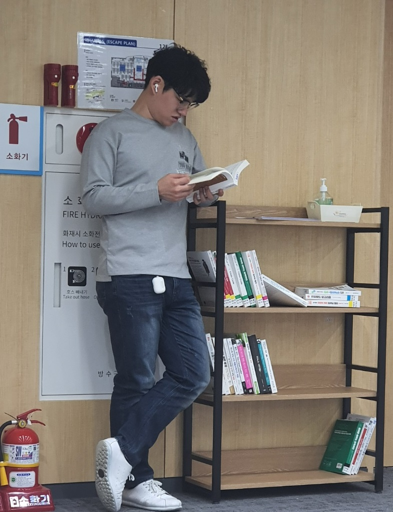

# resume

 

## [[한국어]](./README.md) [English]

Stay Hungry, Stay Foolish

## About Me 

- Last Name: Seok Bin
- First Name : Oh

## Objective
To be Full Stack Programmer.

- Hobby : Jogging, Game, Writing Novel,  Trip, Reading a Book
- Email: osb330@naver.com
- GitHub: [github.com/hasihime](https://github.com/hasihime)
- LinkedIn: [https://www.linkedin.com/in/seokbin-oh-1028a019a/](https://www.linkedin.com/in/seokbin-oh-1028a019a/)

## Education
- Gachon University, Gyeongi, South Korea, 2013 ~ 2019
  - Major : Computer Science()

## Professional Experience
- Samsung Software Academy For Youth(SSAFY), 2019 ~

## Internship Experience
- NeoWiz (2018.06 ~ 2018.12) 
  - security Department
- Somansa (2019.02 ~ 2019.05)
  - security Department

## Project Experience

- Create Diet Webpage Using JAVA [Demonstration](https://www.youtube.com/watch?v=THgKJ4bbMeI)
  - Duration : 2019.09~2019.11 (6 Weeks)
  - Contribution : 50%
  - Technologies Used : 
    - Front : HTML,CSS, Javascript
    - Backend : Spring Boot

 - Create Responsive Web Using Vue [Demonstration](https://youtu.be/hYZudIsAwec)
   - [Summary](./project/02VueProject/VueProjectDoc.md) 
    - Duration : 2020.01 ~ 2020.02(6 Weeks)
    - Contribution : 25%
    - Technologies Used : 
      - Front : Vue.js, Vuetify 
      - Backend : Spring Boot
      - Server : Firebase, Amazon Web Service(AWS)
 
 
### Other  IT Experience

- How to use Suricata [Link](https://github.com/hasihime/resume/blob/master/project/00.SimpleProject/03_suricata/suricata.md)
- Build Private Network using AWS [Link](https://github.com/hasihime/resume/blob/master/project/00.SimpleProject/01_aws/aws.md)
- Naver Cloud [Link](https://github.com/hasihime/Ncloud)
- Build ELK Server [Link](https://osb330.tistory.com/18?category=789618)
- Build Simple BlockChain [Link](https://github.com/hasihime/resume/blob/master/project/00.SimpleProject/02_Blockchain/readme.md)

## Personal Skill
### Programming
- Java
- Python
- Bash

### WEB	Front	
  - HTML
  - CSS3
  - JavaScript
  - Jquery
  
### Back-End	
  - Spring
  - Spring Boot
  - MyBatis

### Server

- AWS
- Firebase
  
### DataBase
  - MYSQL

### OS

- Linux(CentOS, Ubuntu, Kail)
- Window Server 2012

### ETC

- IDS : Suricata
- IPS : Tipping Point IPS 
- Communication : Slack 
- Issue Tracking System : Github, Jira
- Software Configuration Management : Git/GitFlow
- Load Testing : JMeter

### algorithm

Solving algorithm repository - [이동](https://github.com/hasihime/Algo/blob/master/README.md)

### TODO
I'm Interasted in this Tech
- BlockChain
  - Solidity
- Clean Code 

- DID(Decentralized Identification) 

