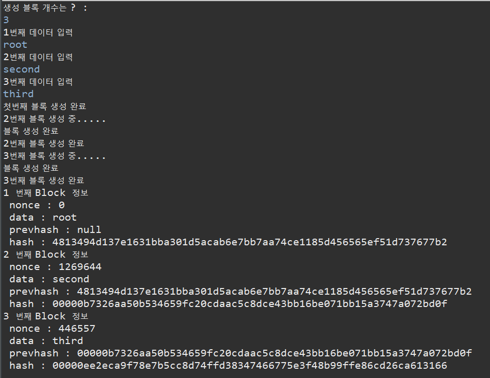

#  블록체인 간단 구현

## 해시의 특성

- 해시는 임의의 길이의 데이터를 고정된 길이의 데이터로 가공하는 기법이다.
- 해시의 가장 큰 특징은 단방향성으로 입력값으로 해시값을 만들면 해시값으로 다시 입력값을 만드는 것은 불가능하다.

- 또다른 특징은 쇄도효과인데 이는 입력의 글자가 한글자만 바뀌어도 해시값이 크게 달라지는 효과가 있다.
  - 입력값 : abcdefg
  - HASH 512 : c11cb6ae7a1173e659b9ea9a39ee269e7f92f0e2b313323b0ef31d6ab557c221c000fa7e492290de71fdfad2f58dcc30573e1366dec358eee1ca8102fb583500
  
- 그럼 abcdefg에서 g를 h로 변경해보았다.

  - 입력값 : abcdefh
  - HASH 512 : 16a80b9f6cb853454bb84b83a3e2bf7477973c0b749e9df25551a814125cb6321929259ec4658452a05c13420494c07ba8837ff64041463e40413ac969418445
<br>

- abcdefg와 abcdefh와 글자 하나가 바뀌었지만 해쉬값은 큰 차이가 있다는 것을 볼 있다. 이런 것을 쇄도 효과(avalanche effect)또는  눈사태 효과 라고 하는데 쇄도효과가 크지 않다면 분석하는 것이 쉬워지기 때문에 이를 고려한 좋은 패스워드 알고리즘이라고 할 수 있다.

- 마지막으로 입력값이 달라도 해시값이 같게 나오는 해시충돌(has collision)을 최대한 피해야 좋은 해시함수라고 할 수 있다. 즉 해시 테이블의 크기 설정이 중요하다.

- 만약 해시 함수가 안전하지 않은 경우 공격자가 입력값에 대한 모든 해시값을 기록한 레인보우테이블(Rainbow Table)을 이용해 데이터를 추출이 가능하다. 이를 막기 위해 난수를 생성해서 해싱을 하는 솔트(SALT)기법이 존재한다.

- 대표적인 해시 알고리즘은 md5, sha-1,sha-2,sha-3가 있다.

## 결과 화면



## 코드 구현

<details><summary>소스 코드 펼치기</summary>

### Block.java

```java
package blockchain;

import java.security.MessageDigest;

public class Block {
	String data;
	String prev;
	String addr;
	int nonce;

	public Block(String data) {
		this.data = data;
		firstBlock(data);
	}
	
	public Block(String data,String prev) {
		this.data = data;
		this.prev=prev;
		findNonce();
	}
	
	public void setAddr(String addr) {
		this.addr = addr;
	}

	public void setNonce(int nonce) {
		this.nonce = nonce;
	}

	//첫번 째 블록 생성.
	public void firstBlock(String data) {
		try {
			MessageDigest digest = MessageDigest.getInstance("SHA-256");
			byte[] hash = digest.digest(data.getBytes("UTF-8"));
			StringBuffer hexString = new StringBuffer();
			for (int i = 0; i < hash.length; i++) {
				String hex = Integer.toHexString(0xff & hash[i]);
				if(hex.length() == 1) hexString.append('0');
				hexString.append(hex);
			}
			setAddr(hexString.toString());
			System.out.println("첫번째 블록 생성 완료");
		} catch (Exception e) {
			// TODO: handle exception
		}
	}
	
	//nonce 값 구하기
	public void findNonce() {
		int num = 0;
		// 해시 앞부분 값이 00000일 경우만 통과
		while (true) {
			try {
				String base = data + "" + num;
				MessageDigest digest = MessageDigest.getInstance("SHA-256");
				byte[] hash = digest.digest(base.getBytes("UTF-8"));
				StringBuffer hexString = new StringBuffer();
				for (int i = 0; i < hash.length; i++) {
					String hex = Integer.toHexString(0xff & hash[i]);
					if(hex.length() == 1) hexString.append('0');
					hexString.append(hex);
				}
				String temphash=hexString.toString().substring(0,5);
				if (temphash.equals("00000")) {
					setAddr(hexString.toString());
					setNonce(num);
					System.out.println("블록 생성 완료");
					return;
				}
			} catch (Exception e) {
				// TODO: handle exception
			}
			num++;
		}
	}
	
	@Override
	public String toString() {
		return "Block 정보 \n "
				+ "nonce : " + nonce + 
				"\n data : " + data + 
				"\n prevhash : " + prev + 
				"\n hash : " + addr ;
	}

}
```

### Main.java

```java
package blockchain;
import java.io.BufferedReader;
import java.io.IOException;
import java.io.InputStreamReader;
import java.util.ArrayList;
import blockchain.Block;
public class Main {

	public static void main(String[] args) throws IOException {
		ArrayList<Block>blockchain=new ArrayList<Block>();
		String data[]=input();
		makeblock(data,blockchain);
		ouput(blockchain);
	}

	private static void ouput(ArrayList<Block> blockchain) {
		int idx=1;
		for (Block block : blockchain) {
			System.out.println(idx+" 번째 "+block.toString());
			idx++;
		}
	}

	private static String[] input() throws IOException {
		BufferedReader br=new BufferedReader(new InputStreamReader(System.in));
		System.out.println("생성 블록 개수는 ? : ");
		int n = Integer.parseInt(br.readLine());
		String[] data=new String[n];
		for (int i = 0; i < n; i++) {
			System.out.println((i+1)+"번째 데이터 입력");
			data[i]=br.readLine();
		}
		return data;
	}

	private static void makeblock(String[] data, ArrayList<Block> blockchain) {
		for (int i = 0; i < data.length; i++) {
			if (i==0) {
				Block first=new Block(data[i]);
				blockchain.add(first);
			}else {
				System.out.println((i+1)+"번째 블록 생성 중.....");
				Block block=new Block(data[i], blockchain.get(i-1).addr);
				blockchain.add(block);
				System.out.println((i+1)+"번째 블록 생성 완료");
			}
		}
	}
}
```

</details>
