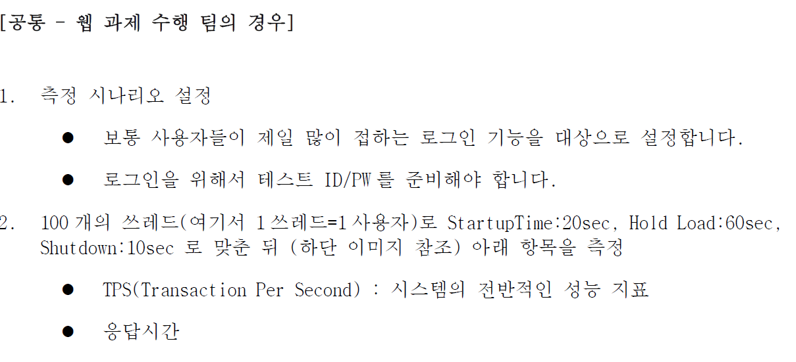
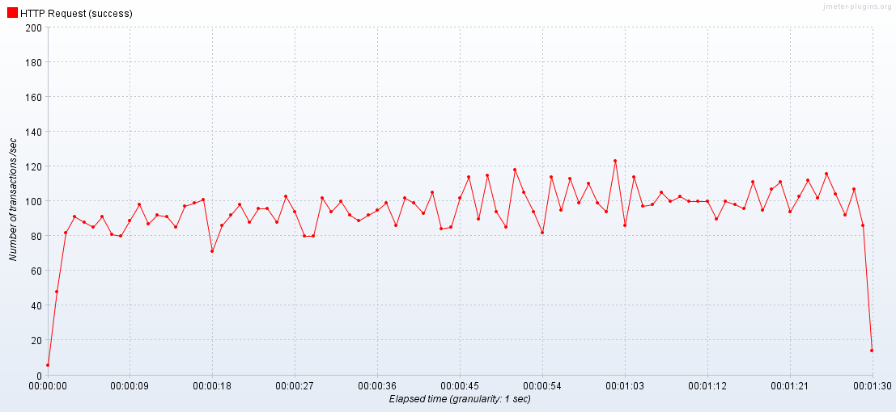
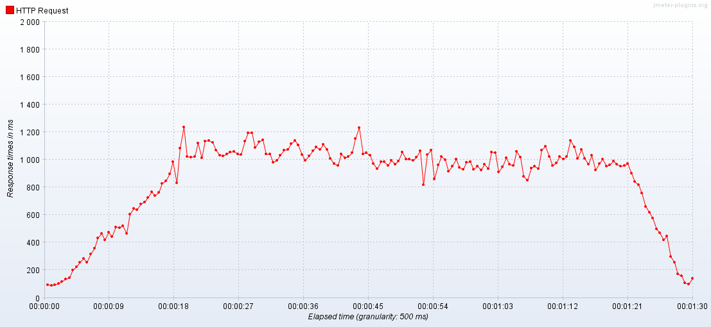
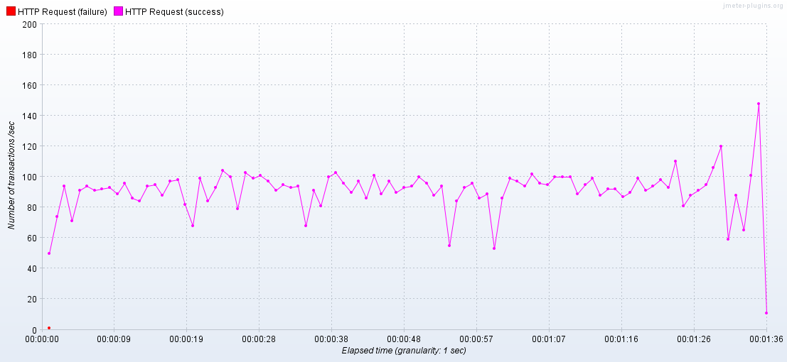
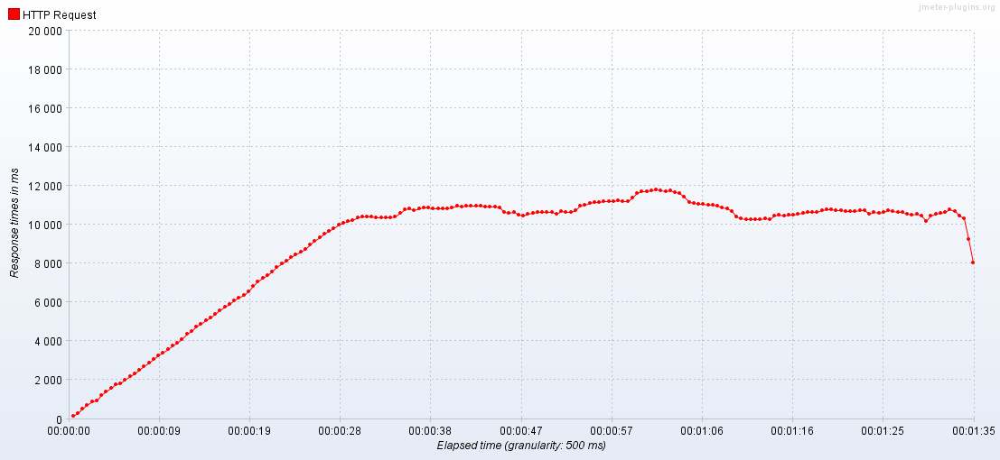
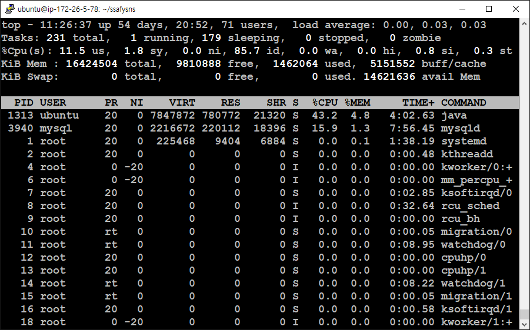

# Jmeter이용한 부하테스트

### 시나리오

1. 측정 결과 그래프는 이미지 캡쳐
- TPS 그래프

    - 100thread는 문제 없음.
- 응답속도 그래프

  - 응답시간도  최대 1200ms선 유지

- 테스트 성공 실패 판단 여부

100 thread는 성공적으로 테스트 완료

1. 심화 과제 
-  이 성공인 경우 : 한계 성능 TPS, 한 계 유 저수
1000 Thread로 설정하고 테스트

    - transection은 100대에서 올라가질 않음  

   - response time은 증가하다 10000ms에서 멈춤

- CPU 점유율

    - cpu는 최대 60%정도 점유하고 있으며 메모리는 최대 7%w점유 (전체 메모리 사이즈는 1.6GB)

결론 : 아무리 높아도 150 tps가 되지 않는 것을 보면 초당 150번 트랜잭션 보내는 것이 한계로 추정됨