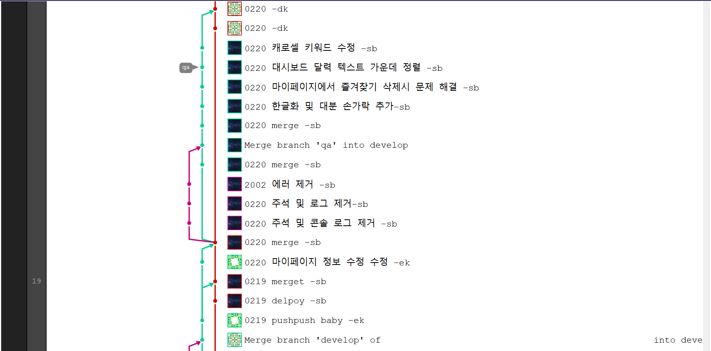
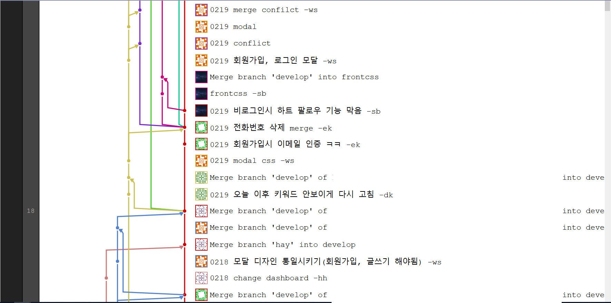
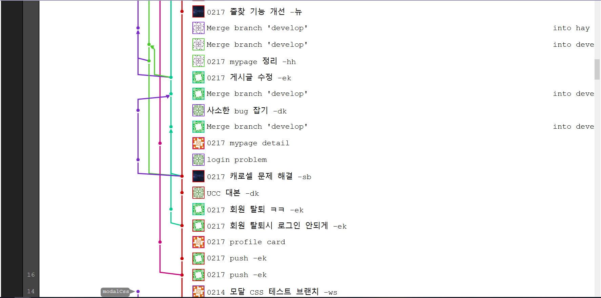
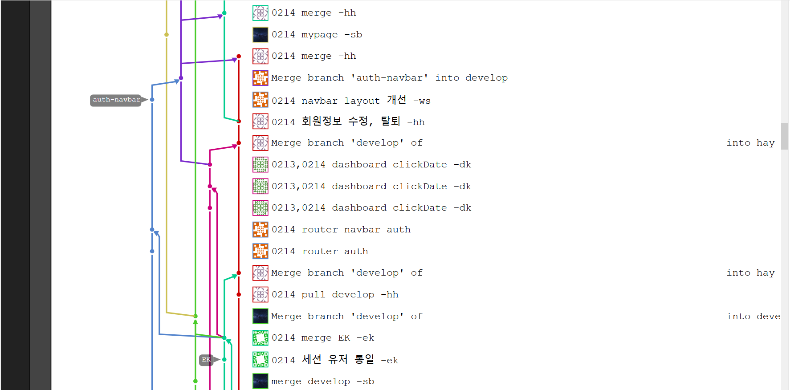
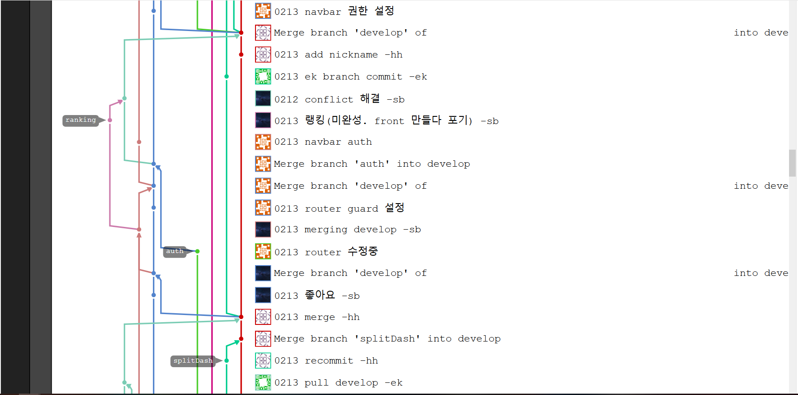
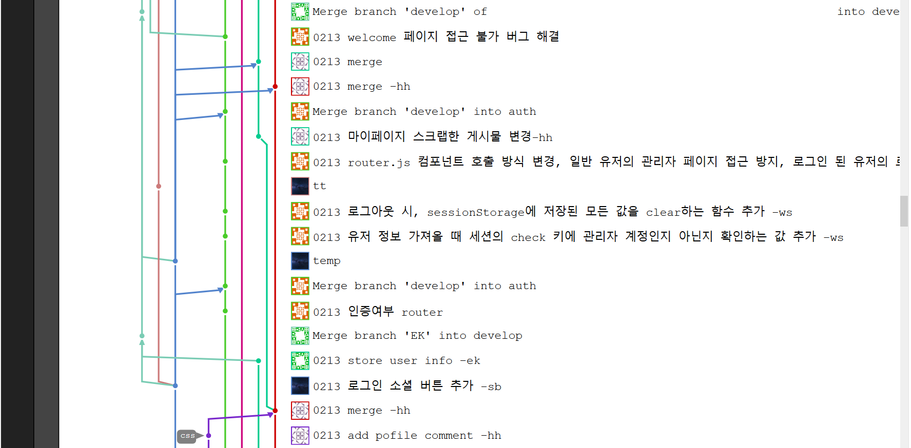
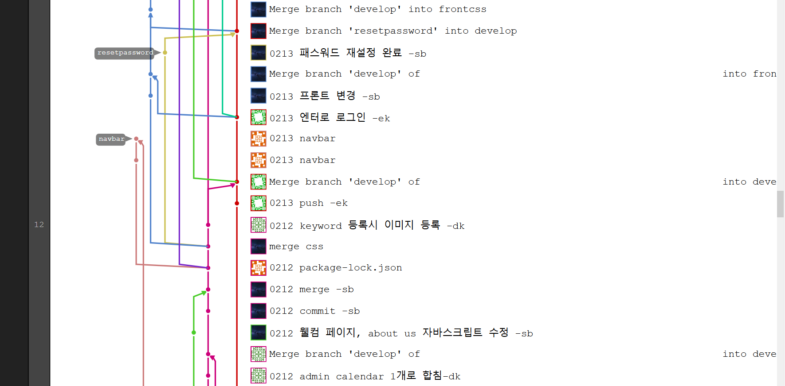
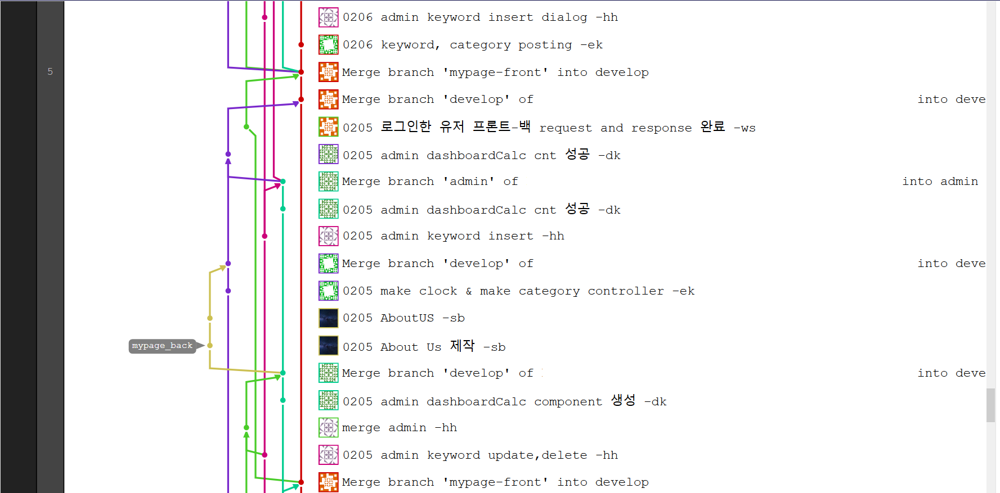

# 창작자들을 위한 공간 Cre8or (임시)

---
## about us

김혜희 : 한줄소개 
오석빈 : [한줄소개](https://github.com/hasihime/resume) 
이다경 : 한줄소개 
이은규 : 한줄소개 
임우섭 : 한줄소개 

## 메인화면

url: https://cre8or-2a293.firebaseapp.com/

- 대문

- 메인 화면

#### test 계정
id = osb330@hanmail.net  
pw = asdasd  

## 기술 스택

## 기능 설명

### 페이지 리스트  
Welcome – Title   
&nbsp;&nbsp;&nbsp;&nbsp;&nbsp;&nbsp;&nbsp;&nbsp;&nbsp;&nbsp;&nbsp;&nbsp;&nbsp;&nbsp;&nbsp;&nbsp;&nbsp;
|_로그인/회원가입  
&nbsp;&nbsp;&nbsp;&nbsp;&nbsp;&nbsp;&nbsp;&nbsp;&nbsp;&nbsp;&nbsp;&nbsp;&nbsp;&nbsp;&nbsp;&nbsp;&nbsp;
|_ 대쉬보드  
&nbsp;&nbsp;&nbsp;&nbsp;&nbsp;&nbsp;&nbsp;&nbsp;&nbsp;&nbsp;&nbsp;&nbsp;&nbsp;&nbsp;&nbsp;&nbsp;&nbsp;
|_ 마이페이지(로그인 필요)  
&nbsp;&nbsp;&nbsp;&nbsp;&nbsp;&nbsp;&nbsp;&nbsp;&nbsp;&nbsp;&nbsp;&nbsp;&nbsp;&nbsp;&nbsp;&nbsp;&nbsp;
|_ 관리자 페이지  
&nbsp;&nbsp;&nbsp;&nbsp;&nbsp;&nbsp;&nbsp;&nbsp;&nbsp;&nbsp;&nbsp;&nbsp;&nbsp;&nbsp;&nbsp;&nbsp;&nbsp;
|_ About Us  
 
### 페이지별 상세 정보  
 

펼치기

  
 
 Welcome ->  
 - 가장 첫 화면. 아무곳이나 터치하면 title로 이동 

Title  
 - Kerosel을 이용한 일간/주간/월간 키워드를 보여줌 
    1. 각 키워드는 시간과 같이 나옴 
 - Welcome을 제외하고 nav바와 footer 등장. 
    1.	Nav 바는 cre8or로고(웰컴 이동), 홈, 대쉬보드, 마이페이지(로그인 페이지), 관리자(admin 계정만) 표시. 모바일로 볼 경우 터치로 nav 바를 스크롤 가능 
    2.	Nav 바에서 키워드 검색 시, 대시보드에서 검색값을 얻을 수 있음. 
    3.	Footer에선 About Us 와 이용약관, 주소가 적혀있음 
 - Speed dial 기능을 통해 비 로그인시 로그인/회원가입 버튼 활성화, 로그인시 글쓰기, 로그아웃, 마이페이지 버튼 활성화 
  
 

#### 로그인  
- Id 패스워드를 통한 로그인 가능 
    1. 최초 로그인 시 메일 주소로 인증 메일을 발송 후 인증을 해야 서비스 이용 가능  
 - 소셜 로그인기능 추가(Google, Facebook) 
    1. 소셜 로그인 시 회원이 아니면 자동 회원가입 
 - 로그인 페이지에서 바로 회원가입 modal로 이동 가능 
 - 패스워드 분실시, 이메일을 입력하면 패스워드 재설정 이메일을 발송. 
 
 

####  About Us  
 - 맴버별 자기소개. 
    1. 썸네일로 표시되다 햄버거 버튼 클릭시 상세보기 나옴 
 
 

####  대쉬보드  
- 오늘 날짜의 일간 키워드로 작성된 post를 보여줌. 
    1. tab기능으로 일간,주간,월간 자유롭게 이동 가능 
    2. 섬네일 이미지는 포스트가 그림인 경우 해당 그림의 미리보기화면이 나오며 그 외에는 기본 이미지 파일이 나온다. 
    3. 대쉬보드는 반응형 웹 기능을 탑재하여 화면 사이즈에 맞게 포스트의 배치가 변경됨. 
- 달력을 열었을 경우, 해당 일/주/월에 맞는 키워드를 표시. 키워드 클릭 시 해당 키워드에 대한 post가 표시됨. 
    1. 달력은 해당일 이전의 키워드만 표시되며 이후의 키워드는 표시되지 않게 설정함. 
- 포스트 작성은 Speed dial을 통해 어디서든지 작성이 가능하며 포스트 작성 버튼 클릭시 해당 기간에 속하는 일/주/월 키워드와 글/그림/음악/영상에 해당하는 카테고리를 선택할 수 있음. 그리고 제목과 내용 작성이 가능하며 파일을 첨부하면 파이어베이스 DB에 업로드를 한다. 
- 포스트를 클릭시, Modal로 포스트를 상세 보기 가능. 상세페이지는 키워드에 맞는 내용을 보여주며 컨텐츠는 글, 그림, 음악, 영상으로 나타남.  
    1. 좋아요와 즐겨찾기 버튼을 클릭시 마이페이지에서 즐겨찾기한 작가와 좋아요한 포스트를 모아서 볼 수 있음 
    2. 포스트를 작성한 사람이면 자유롭게 수정 삭제 가능 
    3. 댓글 기능을 통해 로그인을 한 유저라면 댓글을 추가 및 삭제, 수정이 가능함 
 
 

#### 마이페이지  
- 마이페이지는 로그인을 한 유저한테만 접근이 가능하며 자신의 프로필 영역과 포스트 관련 부분을 확인 할 수 있다.  
    1.	웹화면에서는 프로필과 포스트 영역이 가로로 배치되지만 모바일 화면에서는 프로필 영역 아래에 포스트 영역이 배치된다.  
 - 프로필 영역은 자신의 email, 한줄소개, 프로필 사진을 볼 수 있으며 회원정보 수정과 탈퇴가 가능하다.  
    1. 프로필 사진은 기본 이미지가 들어있으나 수정을 통해 변경이 가능함.  
 - 포스트 영역은 나의 작품, 좋아하는 작가, 좋아하는 작품 3개의 탭으로 구성된다.  
    1. 나의 작품은 여태까지 내가 작성한 포스트를 볼 수 있다.  
    2. 좋아하는 작가는 내가 즐겨찾기한 작가 목록을 볼 수 있으며, 작가를 클릭시 그 작가에 해당하는 마이페이지로 이동이 가능하다.  
    3.좋아하는 작품은 내가 좋아요를 누른 작품을 표시한다.  
 
 

#### 관리자  
- 관리자 페이지는 관리자로 권한을 부여받은 사람만 접근이 가능하며 게시글 관리와 회원관리를 할 수 있다.  
 - 게시글 관리는 달력이 표기되는데 여기서 해당일에 대한 통계를 보거나 키워드를 추가할 수 있음.  
    1. 키워드가 있는 일의 숫자를 누르면 통계 차트를 볼 수 있으며 이 차트는 카테고리 별로 포스트의 분포를 볼 수 있다.  
    2. 키워드를 클릭 시 키워드 수정이 가능하며 키워드별 포스트 개수를 알 수 있다.  
    3. 만약 키워드가 비워있는 일자를 클릭하면 즉시 키워드와 키워드 이미지를 업로드 할 수 있다.  
 - 회원관리는 회원정보를 확인 할 수 있으며 회원별 권한 설정이 가능하다.  
    1. 회원은 이메일, 닉네임 등으로 검색 시 즉각적인 결과를 보여준다.  
    2. 각 컬럼별 오름차순, 내림차순으로 정렬이 가능하다.  
    3. 회원은 한번에 5개,10개,15개,전부 표기하는 식으로 변경이 가능하다.  

 

 

#### git flow
 

펼치기

